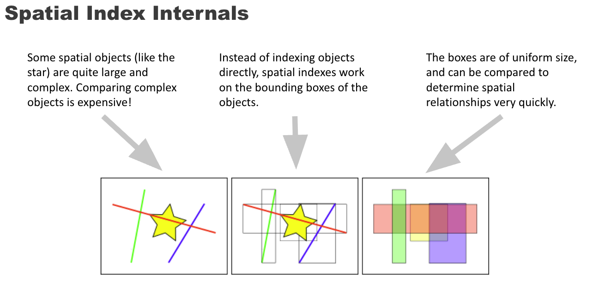

# PostGIS


- [PostGIS Workshop](https://docs.google.com/presentation/d/1tOrp4MQebozybREHYDlE2ZQRlM9Dkne-nRMyCRWc6KY/edit?slide=id.gd85280829a_0_61#slide=id.gd85280829a_0_61)
- [PostgreSQL Not for professional](https://drive.google.com/drive/u/0/folders/1gnZVVymztzGffrfJttUm5e_7RMx4d9Y-)
- [PostGIS in action](https://drive.google.com/drive/u/0/home)

**Designing a Spatial Database best practices**

Use a higher level working area for your geospatial database. If you need to do a national analysis, be ready to import international data source to enrich your analysis.

## 4.1. Spatial Data Model

- Geometry: The planar type.
- Geography: The spheroidal geodetic type.
- Raster: The multiband cell type.
- Topology: The relational

- [Data Management](https://postgis.net/docs/manual-3.6/using_postgis_dbmanagement.html#RefObject)

## Point

Coordinates may contain optional Z and M ordinate values. The Z ordinate is often used to represent elevation. The M ordinate contains a measure value, which may represent time or distance. If Z or M values are present in a geometry value, they must be defined for each point in the geometry. If a geometry has Z or M ordinates the coordinate dimension is 3D; if it has both Z and M the coordinate dimension is 4D.

```sql
POINT (1 2)
POINT Z (1 2 3)
POINT ZM (1 2 3 4)
```

## 4.2. Geometry Data Type

The basis for the PostGIS geometry data type is a plane. The shortest path between two points on the plane is a straight line. That means functions on geometries (areas, distances, lengths, intersections, etc) are calculated using straight line vectors and cartesian mathematics. This makes them simpler to implement and faster to execute.

## 4.3 Geography Data Type

The PostGIS geography data type provides native support for spatial features represented on "geographic" coordinates (sometimes called "geodetic" coordinates, or "lat/lon", or "lon/lat"). Geographic coordinates are spherical coordinates expressed in angular units (degrees).

The spatial type modifier restricts the kind of shapes and dimensions allowed in the column. Values allowed for the spatial type are: POINT, LINESTRING, POLYGON, MULTIPOINT, MULTILINESTRING, MULTIPOLYGON, GEOMETRYCOLLECTION. The geography type does not support curves, TINS, or POLYHEDRALSURFACEs.

### 4.3.3 When to use the Geography data type

The geography data type allows you to store data in longitude/latitude coordinates, but at a cost: there are fewer functions defined on GEOGRAPHY than there are on GEOMETRY; those functions that are defined take more CPU time to execute.

## 4.4 Geometry Validation


| Category        | Name           | SQL Symbol| Aliases             | Description             | Example     |
|-----------------|------------------------------|-|-|-|-|
| **OGC Geometry**| Point| `geometry(Point, SRID)`  | —| Single coordinate (2D, 3D, or 4D)| `ST_GeomFromText('POINT(1 2)', 4326`|
|                 | LineString| `geometry(LineString, SRID)` | —  | Sequence of points forming a line | `ST_GeomFromText('LINESTRING(0 0,1 1)', 4326)`|
|                 | LinearRing| `geometry(LINEARRING, SRID)` | —  | Sequence of points forming a line | `ST_GeomFromText('LINEARRING(0 0,1 1)', 4326)`|
|                 | Polygon   | `geometry(Polygon, SRID)`| —  | Closed shape with outer ring and possible holes | `ST_GeomFromText('POLYGON((0 0,1 0,1 1,0 0))', 4326)`|
|                 | MultiPoint| `geometry(MultiPoint, SRID)`| —  | Collection of points | `geometry(Point,4326)[]`|
|                 | MultiLineString| `geometry(MultiLineString, SRID)`| —  | Collection of lines| —|
|                 | MultiPolygon   | `geometry(MultiPolygon, SRID)`   | —  | Collection of polygons | —|
|                 | GeometryCollection| `geometry(GeometryCollection, SRID)`   | —  | Mixed geometry collection  | —|
|                 | PolyhedralSurface| `geometry(PolyhedralSurface, SRID)`| —  | 3D polygonal surfaces  | —|
|                 | Triangle  | `geometry(Triangle, SRID)` | —  | 3-point polygon triangle   | —    |
|                 | TIN   | `geometry(TIN, SRID)`    | —  | Triangulated Irregular Network  | —   |
| **Measured/3D variants**| Z (3D)   | `geometry(PointZ,SRID)` etc.| `Z` suffix e.g. PointZ, PolygonZ| Include elevation| `geometry(PointZ,4326)`|
|                 | M (measure)    | `geometry(PointM,SRID)`  | `M` suffix e.g. MultiLineStringM | Include custom measure value| —    |
|                 | ZM (3D + measure)| `geometry(PointZM,SRID)` | `ZM` suffix| Both 3D and measure | —    |
| **Generic Geometry**   | Geometry  | `geometry` or `geometry(Geometry,SRID)`| —  | Any geometry subtype    | `geometry`   |
| **Geography**    | Geography | `geography(...)`   | —    | Spheroidal geospatial data (true ellipsoidal math)| `geography(Point,4326)`|
| **Raster** | Raster| `raster`  | —    | Gridded data—images, DSMs, remote sensing—multi-band      | `raster`|
| **Topology**           | TopoGeometry     | `topogeometry`  | —    | Topological primitives (nodes, edges, faces)—requires `postgis_topology`  | `topogeometry`     |
| **Bounding Boxes**     | box2d | —   | `Box2D`          | 2D bounding box type returned by some functions| `ST_Extent(geom)`  |
|                   | box3d | —   | `Box3D`          | 3D bounding box “        | `ST_3DExtent(geom)`|
| **SQL/MM Curves** | CircularString | `geometry(CircularString, SRID)` | —       | Curved line made of one or more circular arcs; each arc is defined by three points (start, control, end). Must have an odd number of points > 1. A closed circle repeats the start/end and uses the middle point opposite on the diameter.  | `ST_GeomFromText('CIRCULARSTRING(0 0,1 1,1 0)', 4326)`                                                                                                                   |
|                   | CompoundCurve  | `geometry(CompoundCurve, SRID)`  | —       | Single continuous curve mixing arc segments and straight LineString segments; each component’s end point must equal the next component’s start point.                                                                                       | `ST_GeomFromText('COMPOUNDCURVE(CIRCULARSTRING(0 0,1 1,1 0),(1 0,0 1))', 4326)`                                                                                          |
|                   | CurvePolygon   | `geometry(CurvePolygon, SRID)`   | —       | Polygon whose rings may be CircularString or CompoundCurve (as well as LineString). PostGIS supports compound curves in curve polygons.                                                                                                     | `ST_GeomFromText('CURVEPOLYGON(CIRCULARSTRING(0 0,4 0,4 4,0 4,0 0),(1 1,3 3,3 1,1 1))', 4326)`                                                                           |
|                   | MultiCurve     | `geometry(MultiCurve, SRID)`     | —       | Collection of curves; members can be LineString, CircularString, or CompoundCurve.                                                                                                                                                          | `ST_GeomFromText('MULTICURVE((0 0,5 5), CIRCULARSTRING(4 0,4 4,8 4))', 4326)`                                                                                            |
|                   | MultiSurface   | `geometry(MultiSurface, SRID)`   | —       | Collection of surfaces; members may be (linear) Polygon or CurvePolygon.                                                                                                                                                                    | `ST_GeomFromText('MULTISURFACE(CURVEPOLYGON(CIRCULARSTRING(0 0,4 0,4 4,0 4,0 0),(1 1,3 3,3 1,1 1)), ((10 10,14 12,11 10,10 10),(11 11,11.5 11,11 11.5,11 11)))', 4326)`  |

### 4.2.1. PostGIS EWKB and EWKT

OGC SFA specifications initially supported only 2D geometries, and the geometry SRID is not included in the input/output representations. The OGC SFA specification 1.2.1 (which aligns with the ISO 19125 standard) adds support for 3D (ZYZ) and measured (XYM and XYZM) coordinates, but still does not include the SRID value.

Because of these limitations PostGIS defined extended EWKB and EWKT formats. They provide 3D (XYZ and XYM) and 4D (XYZM) coordinate support and include SRID information.

### 4.3. Geography Data Type

The PostGIS geography data type provides native support for spatial features represented on "geographic" coordinates (sometimes called "geodetic" coordinates, or "lat/lon", or "lon/lat"). Geographic coordinates are spherical coordinates expressed in angular units (degrees).

The shortest path between two points on the sphere is a great circle arc. Functions on geographies (areas, distances, lengths, intersections, etc) are calculated using arcs on the sphere. By taking the spheroidal shape of the world into account, the functions provide more accurate results.

The spatial type modifier restricts the kind of shapes and dimensions allowed in the column. Values allowed for the spatial type are: POINT, LINESTRING, POLYGON, MULTIPOINT, MULTILINESTRING, MULTIPOLYGON, GEOMETRYCOLLECTION. The geography type does not support curves, TINS, or POLYHEDRALSURFACEs.

**PostGIS extended formats are currently a superset of the OGC ones, so that every valid OGC WKB/WKT is also valid EWKB/EWKT.**

```sql
bytea EWKB = ST_AsEWKB(geometry);
text EWKT = ST_AsEWKT(geometry);
geometry = ST_GeomFromEWKB(bytea EWKB);
geometry = ST_GeomFromEWKT(text EWKT);
```

**Best practices to create a table with a column of data type geography**

It is possible to have more than one geometry column in a table.

```sql
-- 1) Simple "places" table with a geography Point in WGS84
CREATE TABLE public.places (
  place_id    bigserial PRIMARY KEY,
  name        text NOT NULL,
  -- geography enforces type + SRID via typmod
  geog        geography(Point, 4326) NOT NULL
);

-- 2) Spatial index (uses GiST operator class for geography)
CREATE INDEX places_geog_gix
  ON public.places
  USING GIST (geog);

-- 3) (Optional) Generated geography from lon/lat columns
CREATE TABLE public.stations (
  station_id  bigserial PRIMARY KEY,
  lon         double precision NOT NULL CHECK (lon BETWEEN -180 AND 180),
  lat         double precision NOT NULL CHECK (lat BETWEEN  -90 AND  90),
  geog        geography(Point, 4326)
              GENERATED ALWAYS AS (
                ST_SetSRID(ST_MakePoint(lon, lat), 4326)::geography
              ) STORED
);

CREATE INDEX stations_geog_gix
  ON public.stations
  USING GIST (geog);

-- Example insert
INSERT INTO public.places (name, geog)
VALUES ('CN Tower', 'SRID=4326;POINT(-79.3871 43.6426)'::geography);
```

### 4.4.2 Valid Geometry

A `POLYGON` is valid if:

1. The polygon boundary rings (the exterior shell ring and interior hole rings) are simple (do not cross or self-touch). Because of this a polygon cannot have cut lines, spikes or loops. This implies that polygon holes must be represented as interior rings, rather than by the exterior ring self-touching (a so-called "inverted hole").

2. boundary rings do not cross

3. boundary rings may touch at points but only as a tangent (i.e. not in a line)

4. interior rings are contained in the exterior ring

5. the polygon interior is simply connected (i.e. the rings must not touch in a way that splits the polygon into more than one part).

PostGIS allows creating and storing both valid and invalid Geometry. This allows invalid geometry to be detected and flagged or fixed.

By default, PostGIS does not check for validity when loading geometry, because validity testing can take a lot of CPU time for complex geometries. If you do not trust your data sources, you can enforce a validity check on your tables by adding a check constraint:

```sql
ALTER TABLE mytable
  ADD CONSTRAINT geometry_valid_check
 CHECK (ST_IsValid(geom));
```

## 4.5 Spatial Reference Systems identifier (SRID)

A Spatial Reference System (SRS) (also called a Coordinate Reference System (CRS)) defines how geometry is referenced to locations on the Earth's surface. There are three types of SRS:

A geodetic SRS uses angular coordinates (longitude and latitude) which map directly to the surface of the earth.

A projected SRS uses a mathematical projection transformation to "flatten" the surface of the spheroidal earth onto a plane. It assigns location coordinates in a way that allows direct measurement of quantities such as distance, area, and angle. The coordinate system is Cartesian, which means it has a defined origin point and two perpendicular axes (usually oriented North and East). Each projected SRS uses a stated length unit (usually metres or feet). A projected SRS may be limited in its area of applicability to avoid distortion and fit within the defined coordinate bounds.

A local SRS is a Cartesian coordinate system which is not referenced to the earth's surface. In PostGIS this is specified by a SRID value of 0.

There are many different spatial reference systems in use. Common SRSes are standardized in the European Petroleum Survey Group EPSG database. For convenience PostGIS (and many other spatial systems) refers to SRS definitions using an integer identifier called a SRID.

A geometry is associated with a Spatial Reference System by its SRID value, which is accessed by ST_SRID. The SRID for a geometry can be assigned using ST_SetSRID. Some geometry constructor functions allow supplying a SRID (such as ST_Point and ST_MakeEnvelope). The EWKT format supports SRIDs with the SRID=n; prefix.

Spatial functions processing pairs of geometries (such as overlay and relationship functions) require that the input geometries are in the same spatial reference system (have the same SRID). Geometry data can be transformed into a different spatial reference system using ST_Transform and ST_TransformPipeline. Geometry returned from functions has the same SRS as the input geometries.

The `spatial_ref_sys` table definition:

```sql
CREATE TABLE spatial_ref_sys (
  srid       INTEGER NOT NULL PRIMARY KEY,
  auth_name  VARCHAR(256),
  auth_srid  INTEGER,
  srtext     VARCHAR(2048),
  proj4text  VARCHAR(2048)
)
```

```sql
-- Write a query to list all SRID in the table spatial_ref_sys
SELECT DISTINCT srid, auth_name, auth_srid, srtext FROM public.spatial_ref_sys ORDER BY srid;

-- Write a query to count all SRID in the table spatial_ref_sys
SELECT COUNT(DISTINCT srid) AS srid_count FROM public.spatial_ref_sys;

srid_count|
----------+
      8500|
```

A Spatial Reference System defines how the position of points on the Earth's surface is represented in space — through coordinates that are tied to a specific mathematical model of the Earth.

It consists of:

a Datum → defines the size and shape of the Earth (ellipsoid) and how that ellipsoid is aligned to the real Earth (geoid);

a Coordinate system → defines how coordinates (latitude, longitude, height, X/Y/Z, or projected coordinates) are expressed;

a Map projection (optional) → defines how to flatten the Earth's curved surface into a 2D map.

## 4.6 Creating a Spatial Table

The geometry type supports two optional type modifiers:

the spatial type modifier restricts the kind of shapes and dimensions allowed in the column. The value can be any of the supported geometry subtypes (e.g. POINT, LINESTRING, POLYGON, MULTIPOINT, MULTILINESTRING, MULTIPOLYGON, GEOMETRYCOLLECTION, etc). The modifier supports coordinate dimensionality restrictions by adding suffixes: Z, M and ZM. For example, a modifier of 'LINESTRINGM' allows only linestrings with three dimensions, and treats the third dimension as a measure. Similarly, 'POINTZM' requires four dimensional (XYZM) data.

the SRID modifier restricts the spatial reference system SRID to a particular number. If omitted, the SRID defaults to 0.

**Best practice is to name the geometry `geom` to avoid collision between the data geometry, and the column name**

It is possible to have more than one geometry column in a table. This can be specified when the table is created, or a column can be added.

```sql
CREATE TABLE geoms(gid serial PRIMARY KEY, geom geometry );
```

## 4.6.2 GEOMETRY_COLUMNS View

## 4.9 Spatial Indexes


Spatial Indexing is a method of organizing spatial data (points, lines, polygons) so that spatial queries can be performed very quickly.

Why use spatial indexes? Some special objects are quite large and complex they contain many vercel. Instead of indexing objects, directly, spandex is work on the bonding boxes of the objects. The boxes are uniform size and can be compared to determine special relationships very quickly.



Without an index, spatial queries (like ST_Intersects, ST_Within, ST_DWithin, ST_Contains, ST_Distance) would require a full table scan comparing every geometry very slow.

With a spatial index, the database can rapidly filter out most geometries and only test the ones that could actually match.

The B-tree index method commonly used for attribute data is not very useful for spatial data, since it only supports storing and querying data in a single dimension. Data such as geometry (which has 2 or more dimensions) requires an index method that supports range query across all the data dimensions. One of the key advantages of PostgreSQL for spatial data handling is that it offers several kinds of index methods which work well for multi-dimensional data: GiST, BRIN and SP-GiST indexes.

### 4.9.1 GiST Indexes

GiST stands for "Generalized Search Tree" and is a generic form of indexing for multi-dimensional data. PostGIS uses an R-Tree index implemented on top of GiST to index spatial data. GiST is the most commonly-used and versatile spatial index method, and offers very good query performance. Other implementations of GiST are used to speed up searches on all kinds of irregular data structures (integer arrays, spectral data, etc) which are not amenable to normal B-Tree indexing.

```sql
CREATE INDEX [index_name] ON [table_name] USING GIST ( [geometry_field] );

CREATE INDEX [index_name] ON [table_name] USING GIST ([geometry_field] gist_geometry_ops_nd);
```

Building a spatial index is a computationally intensive exercise. It also blocks write access to your table for the time it creates, so on a production system you may want to do in in a slower CONCURRENTLY-aware way:

```sql
CREATE INDEX CONCURRENTLY [index_name] ON [table_name] USING GIST ( [geometry_field] );
```

After building an index, it is sometimes helpful to force PostgreSQL to collect table statistics, which are used to optimize query plans:

```sql
VACUUM ANALYZE [table_name] [(column_name)];
```

### 4.9.2 BRIN Indexes

### 4.9.3 SP-GiST Indexes

### 4.9.4 Tuning Index Usage
